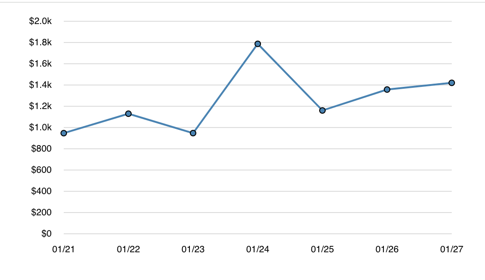

# Line Chart with D3.js and React

This project implements a line chart using **D3.js** in a **React** component. It dynamically renders a line graph based on input data.

## Features
- Renders a responsive line chart using D3.js
- Supports dynamic data updates
- Displays horizontal grid lines for better readability
- Uses a linear curve for sharp angles

## Installation

1. Clone the repository:
   ```sh
   git clone https://github.com/your-repo/line-chart-d3-react.git
   cd line-chart-d3-react
   ```

2. Install dependencies:
   ```sh
   npm install
   ```

## Usage

Import the `LineChart` component and provide it with data:

```jsx
import LineChart from "./LineChart";

const sampleData = [
  { date: "1/21", value: 947 },
  { date: "1/22", value: 1130 },
  { date: "1/23", value: 947.50 },
  { date: "1/24", value: 1787.50 },
  { date: "1/25", value: 1160.50 },
  { date: "1/26", value: 1357.50 },
  { date: "1/27", value: 1420.50 },
];

function App() {
  return (
    <div>
      <h2>Line Chart</h2>
      <LineChart data={data} width={600} height={400} />
    </div>
  );
}

export default App;
```

## Dependencies
- React
- D3.js

## Customization
- Modify the `width` and `height` props to change the chart size.
- Adjust the color of the line by changing `stroke` in the `<path>` element.
- Modify the axis formatting in `d3.axisBottom` and `d3.axisLeft`.

## Output


## License
This project is licensed under the MIT License.

